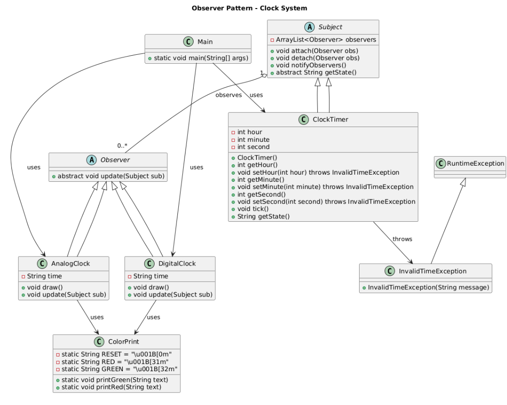

# Observer Pattern - Java Implementation

This project demonstrates the **Observer Pattern** in Java. The Observer Pattern is a behavioral design pattern that defines a one-to-many dependency between objects, so that when one object changes state, all its dependents are notified and updated automatically.

## Overview

In this project, we implement a clock system with the following components:

- **Subject**: The `ClockTimer` class, which maintains time and notifies its observers of updates.
- **Observers**: The `DigitalClock` and `AnalogClock` classes, which display the time in different formats.
- **Observer Interface**: Defines the method `update()`, which is used by the observers to receive updates from the subject.
- **Adapters**: Each clock type has its own adapter to make it compatible with the subject.

### Key Components

1. **Subject (ClockTimer)**: Maintains `hour`, `minute`, and `second` attributes, and notifies observers each time the `tick()` method is called to advance the time.

2. **Observer Interface**: Defines the `update(Subject sub)` method to be implemented by any observer, allowing it to receive updates.

3. **Observers (DigitalClock and AnalogClock)**: Implement the `Observer` interface. Each observer has a `draw()` method that outputs the time in a unique format.

4. **Utility Classes**:
    - **ColorPrint**: Adds color to console output (red for AnalogClock and green for DigitalClock).
    - **InvalidTimeException**: A custom exception to handle invalid time values.

### UML Diagram

Below is the UML diagram illustrating the structure and relationships between components:



The UML diagram highlights the relationships between the `Subject`, `Observer` interface, `ClockTimer`, and observers `DigitalClock` and `AnalogClock`.

## How to Use

[//]: # (1. Clone the repository and navigate to the `ObserverPattern/` directory.)
1. Compile the project:

    ```bash
    javac Main.java
    ```

2. Run the main class to observe the Observer Pattern in action:

    ```bash
    java Main
    ```

3. Example output:

    ```
    The Digital Clock time is 00:00:01
    The Analog Clock time is 00:00:01
    The Digital Clock time is 00:00:02
    The Analog Clock time is 00:00:02
    ...
    The digital clock has been detached

    The Analog Clock time is 00:00:11
    The Analog Clock time is 00:00:12
    ...
    ```

In this output, both clocks display synchronized updates, until the digital clock is detached, after which only the analog clock continues to update. This demonstrates the Observer Pattern in action.
